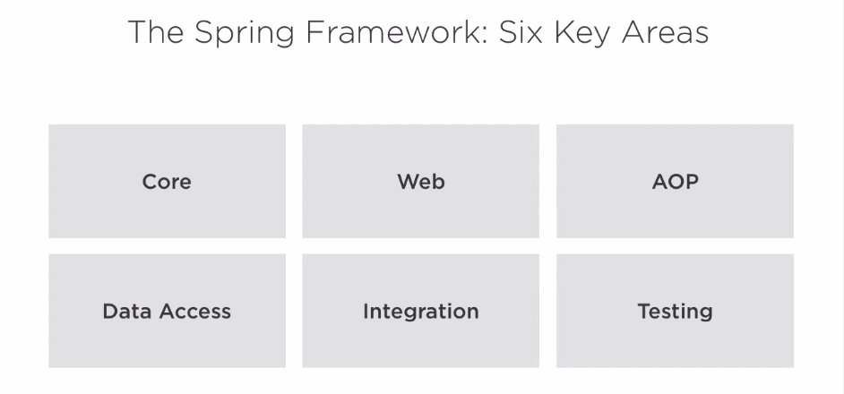
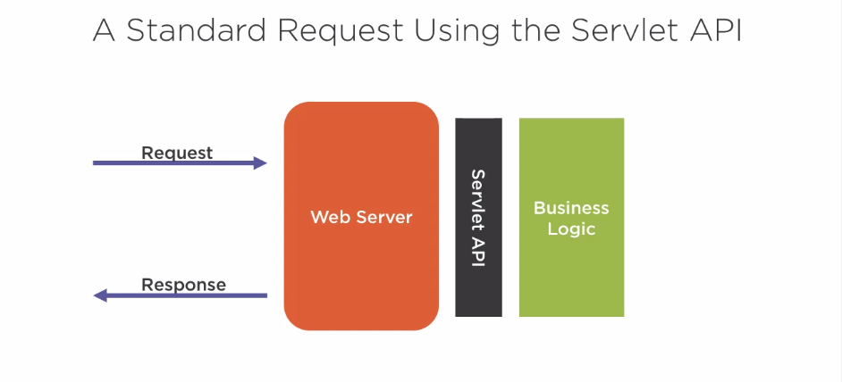
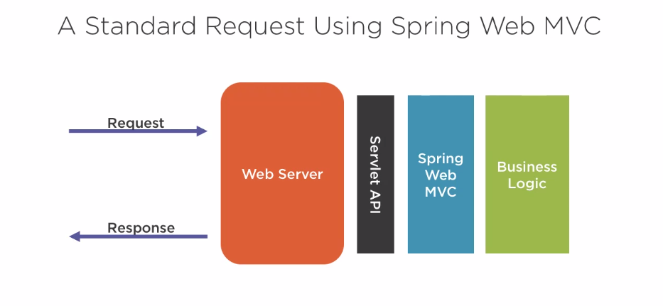
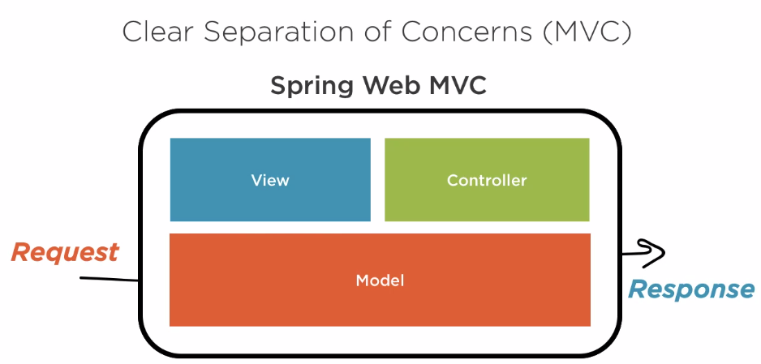

# Spring Framework Foundations

## Introduction

The Spring Framework is a **Software Framework** as defined by Wikipedia:

> is a universal, reusable software environment that provides particular functionality as part of a larger software platform to facilitate development of software applications, products and solutions.

Specifically, a software environment is *universal* and *reusable*, which Spring Framework very much meets this definition. Also, a software framework should provide *particular functionality* which for Spring Framework it means things like **web development** and **data access**. Moreover, a software framework should *belong to a larger software platform*, which is **Java platform** for Spring Framework. Lastly, software frameworks *facilitate development software applications, products and solutions*, just like how Spring Framework **makes development of web applications easier**.

The Spring Framework is the start of Spring today, enterprise Java Development was very complex at the time and people developed Spring Framework to make development easier. Built upon Spring Framework, applications can further utilize Spring Projects along with Spring Framework to make things even easier.


## The Six Key Areas of Spring Framework

The Spring Framework is modular and could be divided into six areas as follows:



## Spring Core


It is one of the most important features of the Spring Framework, it serves as the foundational module for other modules like **Integration**, **Web**, **Data Access**, **Testing**, **AOP**. Spring Core provides a number of different features like:

- i18n internationalization support
- Validation support
- Data binding support
- Type conversion support
- etc.

But the center of Spring Core is **Dependency Injection**. Usually, developers create objects to represent or model real-life things, and some objects don’t exist by themselves, instead they are dependent on other objects. For instance, the `Computer` object has dependencies on other objects like `HardDisk` or multiple `Memory` objects.

```java
public class Computer {
    HardDisk hd;
    Memory[] ram;
}
```

> Dependency Injection is about dealing with the way objects fulfill their dependent objects.

There are two choices of fulfilling dependencies:

- The object fulfills its own dependencies
- The object declares what it depends on and something else fulfills the dependency

The first approach might seams easier but has the limitation of making objects **tightly coupled** while the second approach is much flexible since the objects are **loosely coupled**.

The second approach is called **Dependency Injection**. Spring Core is considered as a ***Dependency Injection Container***:

- Creates and maintains objects and their dependencies, which results less things for the developer to manage.
- It’s also the thing that combines many individual parts of the application together, like a glue.

## Spring Web

The web support of Spring Framework is provided via the **Web** module. The **Spring Web** is a framework of handling web requests in two different ways:

- Spring Web MVC
- Spring WebFlux

### Spring Web MVC

To understand what Spring Web MVC is, let’s first take a look at the Java `Servlet` API which as per Wikipedia:

> A Servlet is an object that receives a request and generates a response based on that request.

Traditionally, a standard request is sent via the web server and get processed through the business logic via the `Servlet` API and then gets returned by the response generated by the web server.



Servlet works but there are some issues with it:

- A low-level API and lack of abstraction
- Harder to use
- Less productive

Spring Web MVC builds upon `Servlet` API to make development easier and more productive:



It is a higher level API and offers productivity and *clear separation of concerns (MVC)*:



### Spring WebFlux

To understand Spring WebFlux, we need to first understand what **Reactive Programming**:

> … a declarative programming paradigm concerned with data streams and the propagation of change.

which literally means you **react** to change rather than **wait** to change.

Spring’s reactive programming framework is the **Spring WebFlux**:

- A different way of handling web requests:
  - Asynchronous execution
  - Doesn’t block (wait), this results in **better resource utilization**

In a traditional flow, requests are executed step by step due to its dependency on different resources, in a reactive flow, however, request execution is carried out asynchronously and don’t need to wait for completing execution of a single request to proceed, the code will be notified after the each execution of a request completed.

## Spring AOP

As per Wikipedia, Spring AOP is: 

> a programming paradigm that aims to increase modularity by allowing the separation of cross-cutting concerns.

A few key concepts here:

- Programming paradigm: it simply means of programming or writing code
- Modularity: increasing organization
- Cross-cutting concerns: they are referring to concerns that cross various aspects of layers, or tiers of the application, like security because security can’t be contained to any one area of the applications, instead it spans multiple parts of the application.

> To put it another way, Aspect-Oriented Programming (AOP) is a way of programming that increases organization of code for concerns that span multiple tiers of an application.

> Without AOP, solving concerns that are cross-cutting results in *scattered* and *duplicated* code *across many parts of an application*.

Spring AOP is an implementation of AOP in the Spring Framework, which has two main use cases:

- Used to implement features in Spring
- A valuable tool for developers to handle cross-cutting concerns

### Example: Application Security

```java
public void sensitiveOperation() {
    // Check if user is authenticated and has the correct role.
    if (...) {
        // Do sensitive operations.
    } else {
        // Raise an unauthorized error log failed attempt redirect
        // user to login page.
    }
}
```

These operations are very likely to occur in many places throughout the application. Spring AOP helps us to organize these operations into a single area that can be applied to different parts of the application.

### Example: Application Security with Spring AOP

```java
@PreAuthorize("hasRole('admin')")
public void sensitiveOperation() {
    // Do sensitive operations.
}
```

## Spring Data Access

Almost every application interacts with data. The Spring Framework’s **Data Access** module makes it easier to develop applications that interact with data.

### Example: Java Database Connection API (JDBC)

```java
/* Code to retrieve data using JDBC. */
try {
    Statement statement = conn.createStatement();
    try {
        /* Important retrieval logic. */
        ResultSet resultSet = statement.executeQuery("SELECT COUNT(*) FROM foo");
        try {
            /* Important result logic. */
            resultSet.next();
            int count = resultSet.getInt(1);
        } finally {
            resultSet.close();
        }
    } finally {
        statement.close();
    }
} catch (SQLException e) {
    // Handle error.
} finally {
    try {
        conn.close();
    } catch (SQLException e) {
        // Handle error.
    }
}
```

The other parts are boiler-plate code. Using Spring Framework’s Data Access module, we can reduce boiler-plate code:

```java
int count = new JdbcTemplate(ds).queryForInt("SELECT COUNT(*) FROM foo");
```

> Database transactions with the Spring Framework’s Data Access module are extremely easy.

> A transaction is a general unit of work that must **happen together** or **not at all**. Hence a database transaction is a series of database operations that must happen together or not at all.

Let’s take bank transactions as a concrete example. If we would like to transfer money from one bank account to another, we need to first deposit from bank account A and then transfer it to bank account B. If the deposit from back account A fails, but the money transfer to bank account B succeeds, then A just get free money. Similarly, if transfer succeeds, then the money from A is lost.

Let’s take look at another example:

```java
try {
    connection.setAutoCommit(false);
    // Execute a series of database operations within the transaction.
    connection.commit();
} catch (Exception e) {
    connection.rollback();
} finally {
    connection.close();
}
```

The same code is a lot simpler with the Transactional Support from the Spring Framework:

```java
@Transactional
public void operation() {
    // Execute a series of database operations within the transaction.
}
```

### Exception Translation

Another small but useful feature of Spring Data Access module is **Exception Translation**. Exceptions are an event within a program that disrupt execution. Since different database vendors have different exceptions for the same class of errors. For example, the same data integrity violation error would look different in MySQL and Oracle:

- MySQL: 630, 839, 840, etc.
- Oracle: 1400, 1722, 2291,etc.

The Spring Data Access module takes these vendor-specific exceptions and maps/translates them into a well-known set of exceptions.

Another good thing about Spring Data Access module is that it makes testing data easier. It is easy to **switch configurations for testing** to use test data with embedded database instead of important production data alone.

## Spring Integration

Application don’t work in isolation, integration is all about making different systems and applications work together.

### Communications between applications

This is a multisided problem:

1. How do you expose operations to other systems?
2. How do you invoke or run operations in other systems

#### Exposing operations

There are many ways to **expose** operations that Spring Framework supports:

- RMI (Remote Method Invocation)
- Messaging Systems
- Web Services: the Spring Framework makes it easy to both *expose* and *invoke* web services, as per the example banking account application shown below, it shows how to expose web services so as to retrieve bank account number by id:

```java
// Denotes we're using a REST style web service.
@RestController
public class AccountController {
    // Denotes operation and path.
    @GetMapping("/account/{id}")
    public Account find(@PathVariable int id) { // Associates path and value
        // Look up account by id.
    }
}
```

From this example, we can see we could *expose* the operation of bank account number retrieval by providing the account id using REST Web Service.

#### Invoking Operations

The Spring Framework provides support for programmatically invoking our REST service by utilizing `@RestTemplate`, which:

- Abstracts away tedious details
- Handles
  - Connecting to the web service
  - Sending the command
  - Handling the response from the web service
- Super easy to use:

```java
// @RestTemplate makes calling REST Web Services as easy as oneline.
restTemplate.getForObject("http://foo.com/account/123", Account.class);
```

## Spring Testing

Testing is a very important part of developing software, Spring Framework focuses two major areas of testing:

- Unit Testing
- Integration Testing

### Unit Testing

As per the definition of techtarget.com, Unit Testing is:

> … a software development process in which the smallest testable parts of an application, called units, are individually and independently scrutinized for proper operation.

Note that a side effect of dependency injection is that it makes explicit support for unit testing a lot easier. Since dependency injection is about *dealing with the way objects fulfill their dependent objects*.

####  Testing and Dependency Injection

The idea of Unit Testing is to **test the smallest unit of code possible**. When the code to test has dependencies, it might become challenging since we only want to test the code, not the dependencies. However, dependency injection makes testing a lot easier by enforcing developers to declare their dependencies so that during testing dependent code can be replaced with the code that behaves a certain way by **Mocking** dependencies. With the feature, we could **ONLY** test the code and forget about the dependencies. For example, suppose the following code snippet grands people certain permissions that based on their security clearance levels:

##### Example:  Using Dependency Injection in Testing

```java
public Permission getPermissions(SecurityManager securityManager) {
    String securityLevel = securityManager.getSecurityLevel();
    
    if (securityLevel.equals("CONFIDENTIAL")) {
        // Give the user confidential permissions.
    } else if (securityLevel.equals("SECRET")) {
        // Give the user secret permissions.
    } else if (securityLevel.equals("TOP_SECRET")) {
        // Give the user top secret permissions.
    }
}
```

The objective is to test **every condition**, which is all the security levels in our case. Thanks to dependency injection, we could control how the `SecurityManager` (a dependency) behaves to control the test, in other words, we could control the `securityLevel` it returns. For example, we could control the `SecurityManager` to always return `"CONFIDENTIAL"` `securityLevel` to enter the first `if` block, `“SECRET"` to enter the second, and `“TOP_SECRET”` to enter the third.

Spring Framework comes with several built-in mocks to make testing easier and faster.

### Integration Testing

As per Wikipedia, Integration Testing is:

> … the phase in software testing in which individual software modules are combined and tested as a group. It occurs after unit testing…

Spring Framework supports Integration Testing by  piecing together parts of an application for testing (inject dependencies and put everything together). Spring Framework also provides support for common testing scenarios like testing with data access and web application testing. Another feature is that Spring Framework provides support for cleaning up after tests since tests modify things, and we need to reverse the modifications after the test so that the following tests will not be affected.


