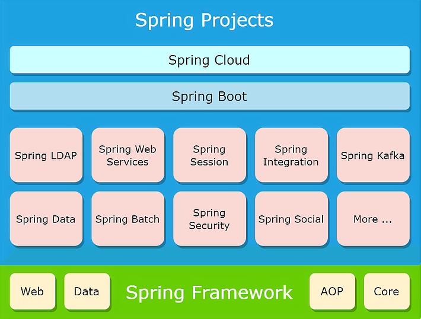

# Introduction

Go back to  <a style="text-decoration:none" href="https://helloimlixin.github.io/Spring-Framework-Knowledge-Stack/">Homepage</a>.

Mostly, Spring refers to the entire family of Spring projects built upon the Spring Framework or the *Spring Ecosystem*. The point of using Spring Framework is essentially to create an easier alternative to create Java Enterprise applications than Java EE. However, currently Spring offers much more than the original Java EE due to its consistent evolution. Nowadays, with the help of Spring Boot, the Spring applications could be created in a DevOps and Cloud friendly manner with the embedded Servlet Container. The Spring Framework 5 offers WebFlux application that does not even use the Servlet API directly and can run on servers that are not Servlet containers. The Spring also comes along with a number of other projects like  Spring Security, Spring Data, Spring Cloud, etc.

## The Spring Family

The Spring Projects are built upon the creation of the Spring Framework, which originally aims at addressing the complexity of developing Java Enterprise applications using Java EE framework. The Spring Framework makes it easy for Web Development, Data Access, and reduces the boiler-plate code that might clutter the application. A good variety of Spring Projects tailored to specific demands are then developed based on the Spring Framework. Out of which Spring Boot is a big game changer with features like auto-configuration and massive simplification of deployment process, etc.

Spring started as a response to the complexity of J2EE (now Java EE), however, nowadays it's so much more than an simple alternative to Java EE, it's in fact complimentary to Java EE and makes use several of the standard specifications like the Java Persistence API. In short,

> Spring makes it easier to develop Java Enterprise applications.

Spring is flexible, modular, backwards compatible and has a large and active community, Spring also continually innovates and evolves with state-of-the-art technologies resolving the challenges people might encounter every single day.

