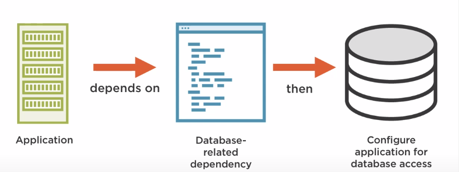
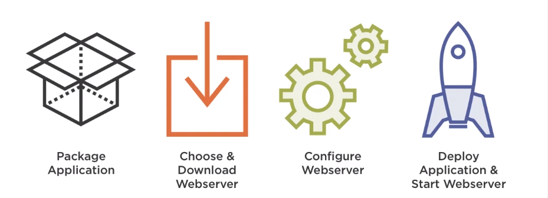
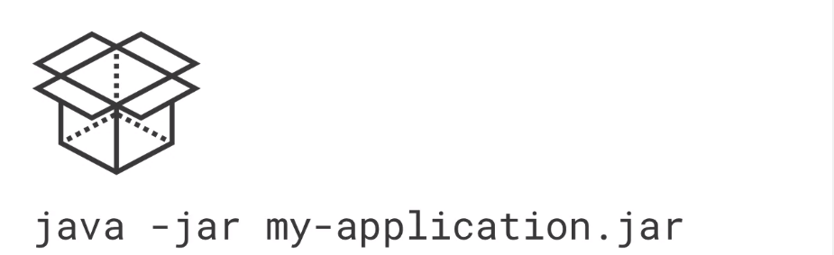

# Understanding Spring Boot

## Introduction

> Spring Boot Makes Getting Started with Spring **Quick** and **Easy**

Learning new technologies can be hard and overwhelming. Spring Boot makes it easier to get started with Spring without the need of understanding all the details. One more good thing about Spring Boot is that it is **Fully-Featured** and heavily used in industries.

## Key Features

Spring Boot makes it possible to build **Web** and **Non-Web** applications. Built on top of the **Spring Framework**, Spring Boot has a number of notable features that make it unique and easy to use:

- **Auto-Configuration**: Spring Boot will automatically set up the application based on the specifications provided
- **Standalone**: you don’t need to deploy the application on the web server or a special environment, you can just run the application with one command
- **Opinionated**: Spring Boot has a chosen way of doing things by default.

## Spring Boot Auto-Configuration

Auto-Configuration is a feature of Spring Boot that provides a **Best Guess** configuration of the application, as per the documentation:

> … attempts to automatically configure your Spring application based on the … dependencies that you have added.

  It does this by being both **Contextually Aware** and **Smart**. For instance, if Spring Boot knows that the application has a dependency that’s related to Database, it will make some reasonable assumptions so as to configure the application for database access.

Setting up Auto-Configuration is Effortless, you’ll just need to add the `EnableAutoConfiguration` annotation to the Spring Boot application.

```java
@EnableAutoConfiguration
public class mySpringBootApplication {
    ...
}
```

It is also easy to disable, or, **non-invasive**.

## Spring Boot Is Standalone

As per the documentation:

> Spring Boot makes it easy to create stand-alone, production-grade, Spring-based applications that you can ‘just run’.

To understand how helpful this feature is for development, let’s take a look at the procedures of how a typical Java web application is run:

1. Package the application
2. Choose and download the web server
3. Configure the web server
4. Deploy application & start the web server



For Spring Boot, it “just runs”:

1. Package the application
2. Run the application



## Spring Boot Is Opinionated

As per the documentation:

> “Takes an opinionated view of building production-ready Spring applications.”

When building Java web applications, you might encounter tons of choices like *library choices*, *config choices*, *tooling choices*, etc. Spring Boot removes this burden by:

> … favors convention over configuration and is designed to get up and running as quickly as possible.”

Like what http://start.spring.io/ can do.